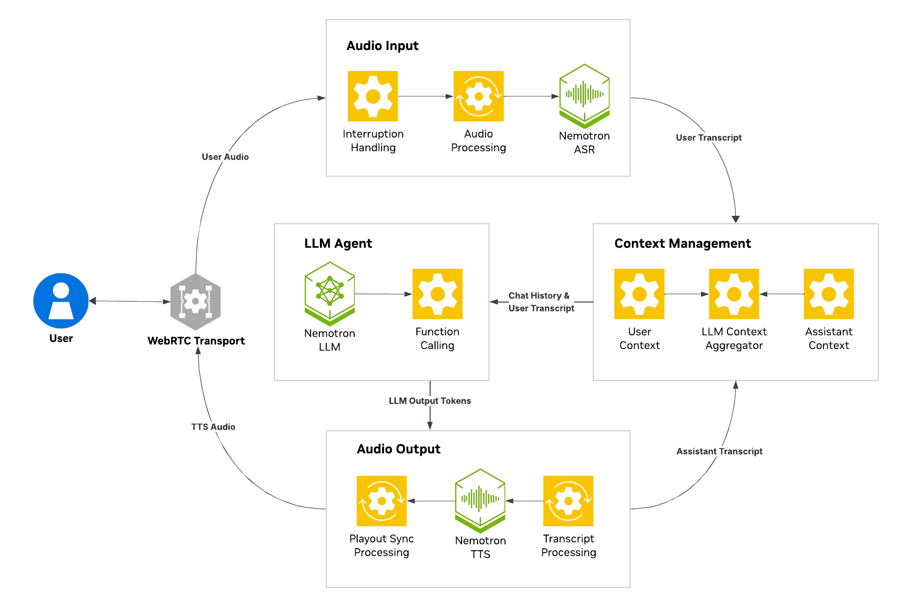

# Nemotron Voice Agent

Nemotron Voice Agent provides a comprehensive, end-to-end voice agent blueprint built with NVIDIA Nemotron state-of-the-art open models, as NVIDIA NIM for acceleration and scaling. It is designed to guide developers through the creation of a cascaded pipeline, integrating Nemotron ASR, LLM, and TTS, while solving for the complexities of streaming, interruptible conversations. By leveraging NVIDIA NIM microservices, this developer example enables developers to accelerate the deployment of high-performance voice AI solutions.


---

## Key Components

The following are the key components in this blueprint:

- **NVIDIA Nemotron Speech ASR & TTS**: High-performance streaming speech recognition and multilingual text-to-speech synthesis.
  - [Parakeet CTC 1.1B ASR](https://build.nvidia.com/nvidia/parakeet-ctc-1_1b-asr/modelcard)
  - [Parakeet 1.1B RNNT Multilingual ASR](https://build.nvidia.com/nvidia/parakeet-1_1b-rnnt-multilingual-asr/modelcard)
  - [Magpie TTS Multilingual](https://build.nvidia.com/nvidia/magpie-tts-multilingual/modelcard)
- **NVIDIA Nemotron LLMs**: State-of-the-art LLM models engineered for real-time conversational use cases.
  - [Nemotron 3 Nano 30B A3B](https://build.nvidia.com/nvidia/nemotron-3-nano-30b-a3b/modelcard)
  - [Llama 3.3 Nemotron Super 49B v1.5](https://build.nvidia.com/nvidia/llama-3_3-nemotron-super-49b-v1_5/modelcard)
- **Pipeline Orchestration**: Built on top of the Pipecat framework with WebRTC transport, enabling low-latency real-time voice communication and speculative speech processing capabilities.


---

## Requirements

Check the following requirements before you begin.

### Hardware Requirements

This blueprint requires **2 NVIDIA GPUs** (Ampere, Hopper, Ada, or later).
- **GPU 0**: For running NVIDIA Nemotron Speech ASR (Automatic Speech Recognition) and TTS (Text-to-Speech) models.
  - **Total VRAM required for ASR and TTS models: 48 GB**
- **GPU 1**: For running NVIDIA LLM NIM.
  - [Nemotron 3 Nano 30B A3B](https://build.nvidia.com/nvidia/nemotron-3-nano-30b-a3b/modelcard): 48 GB VRAM
  - [Llama 3.3 Nemotron Super 49B v1.5](https://build.nvidia.com/nvidia/llama-3_3-nemotron-super-49b-v1_5/modelcard): 80 GB VRAM

### Software Requirements

- **NVIDIA NGC**: Valid credentials for NVIDIA NGC. See the [NGC Getting Started Guide](https://docs.nvidia.com/ngc/ngc-overview/index.html#registering-activating-ngc-account).
- **NVIDIA API Key**: Required for NVIDIA NIM models and NGC container images. Get yours at [build.nvidia.com](https://build.nvidia.com/).
- **Docker**: With NVIDIA GPU support installed.
- **NVIDIA NIM**: Required for running NVIDIA NIM models. See the [NVIDIA NIM Getting Started Guide](https://docs.nvidia.com/nim/riva/asr/latest/getting-started.html#prerequisites).

---

## Quick Start

Start the application following these steps.

1. Clone the repository and navigate to the root directory and copy the example environment file [.env.example](config/env.example) to the root directory.

    ```bash
    git clone git@github.com:NVIDIA-AI-Blueprints/nemotron-voice-agent.git
    cd nemotron-voice-agent
    git submodule update --init
    cp config/env.example .env
    ```

2. Set your NVIDIA API key as an environment variable:

    ```bash
    export NVIDIA_API_KEY=<your-nvidia-api-key>
    ```

3. Login to NVIDIA NGC Docker Registry.

    ```bash
    export NGC_API_KEY=<your-nvidia-api-key>
    docker login nvcr.io
    ```

4. Deploy the application.

    ```bash
    docker compose up -d
    ```

    > **Note:** Deployment may take 30-60 minutes on first run.

5. Enable microphone access in Chrome before opening the app in the browser. Go to `chrome://flags/`, enable "Insecure origins treated as secure", add `http://<machine-ip>:9000` to the list, and restart Chrome.

    > **Note:** If this step is skipped, the UI may show `Cannot read properties of undefined (reading 'getUserMedia')` error.
    >
    > The UI might also get stuck or fail to access the microphone if you connect remotely (e.g., via public IP or cloud) and a TURN server is not configured.
    > If you need to access the application from remote locations or deploy on cloud platforms, configure a TURN server—see [Optional: Deploy TURN Server for Remote Access](docs/01-getting-started.md#optional-deploy-turn-server-for-remote-access).

6. Access the application at `http://<machine-ip>:9000/`

    > **Tip:** For the best experience, we recommend using a headset (preferably wired) instead of your laptop's built-in microphone.

For detailed setup instructions and troubleshooting, proceed to [Getting Started Guide](docs/01-getting-started.md).

---

## Agent Skills

This repository includes AI agent skills for deployment assistance. Install them for your coding agent with:

```bash
npx skills add .
```

---

## Documentation

| Type | Guide | Description |
|------|-------|-------------|
| Tutorial | [Getting Started](docs/01-getting-started.md) | Full deployment guide with prerequisites, GPU setup, and step-by-step instructions |
| How-to | [Configuration Guide](docs/02-configuration-guide.md) | Configuration guide on the `.env` file depending on various use cases |
| How-to | [Enable Multilingual Voice Agent](docs/how-to/enable-multilingual.md) | Enable multi-language conversations with automatic language detection |
| How-to | [Jetson Thor Deployment](docs/03-jetson-thor.md) | Edge deployment guide for NVIDIA Jetson Thor platform |
| How-to | [Tune Pipeline Performance](docs/how-to/tune-pipeline-performance.md#speculative-speech-processing) | Reduce latency with speculative speech and other performance settings |
| Explanation | [Best Practices](docs/04-best-practices.md) | Production deployment, latency optimization, and UX design guidelines |
| Reference | [NVIDIA Pipecat](docs/05-nvidia-pipecat.md) | Overview of Pipecat services and processors for voice AI pipelines |
| Reference | [Evaluation and Performance](docs/06-evaluation-and-performance.md) | Accuracy benchmarking and latency/perf tests |

---


## License

This NVIDIA AI BLUEPRINT is licensed under the BSD 2-Clause License. See [LICENSE](LICENSE) for details. This project may download and install additional third-party open source software and containers. Review the license terms of these projects in [third_party_oss_license.txt](third_party_oss_license.txt) before use.
