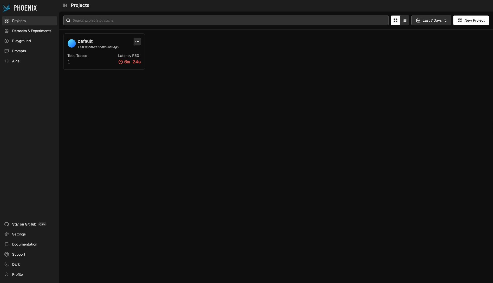
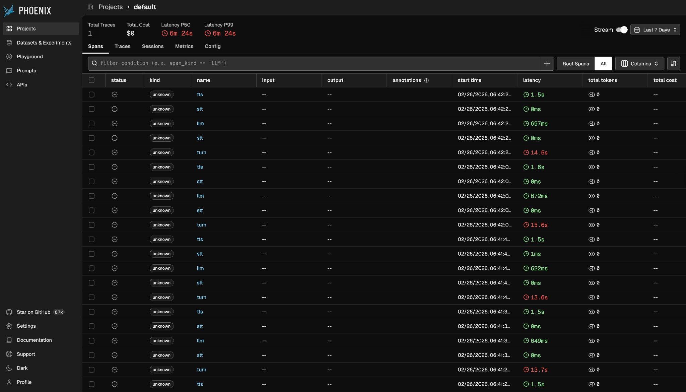
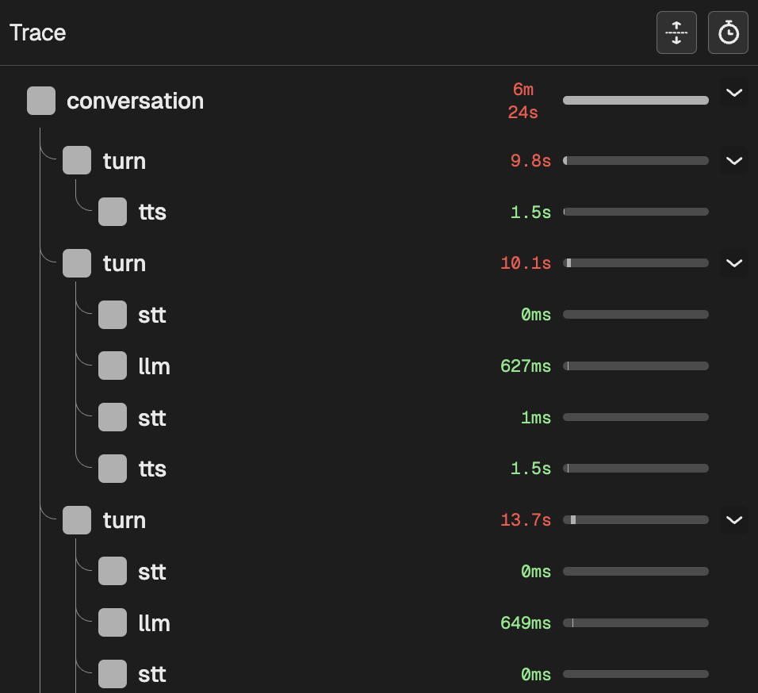
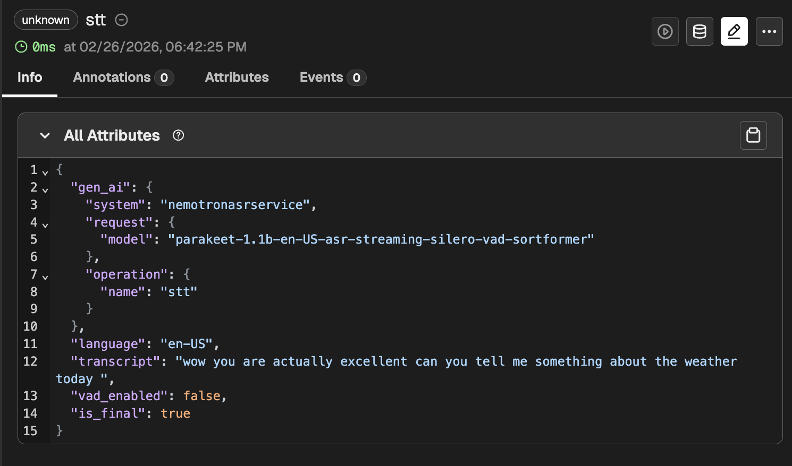
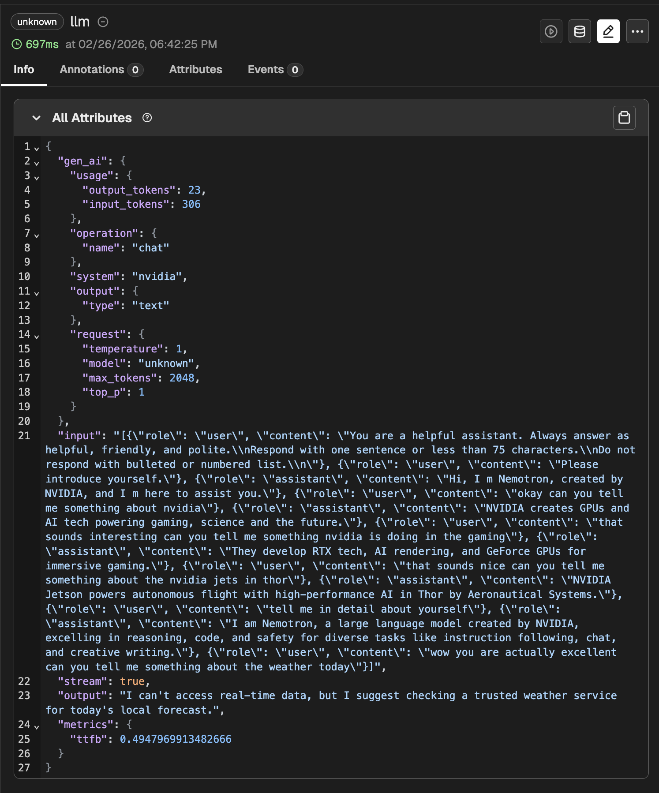
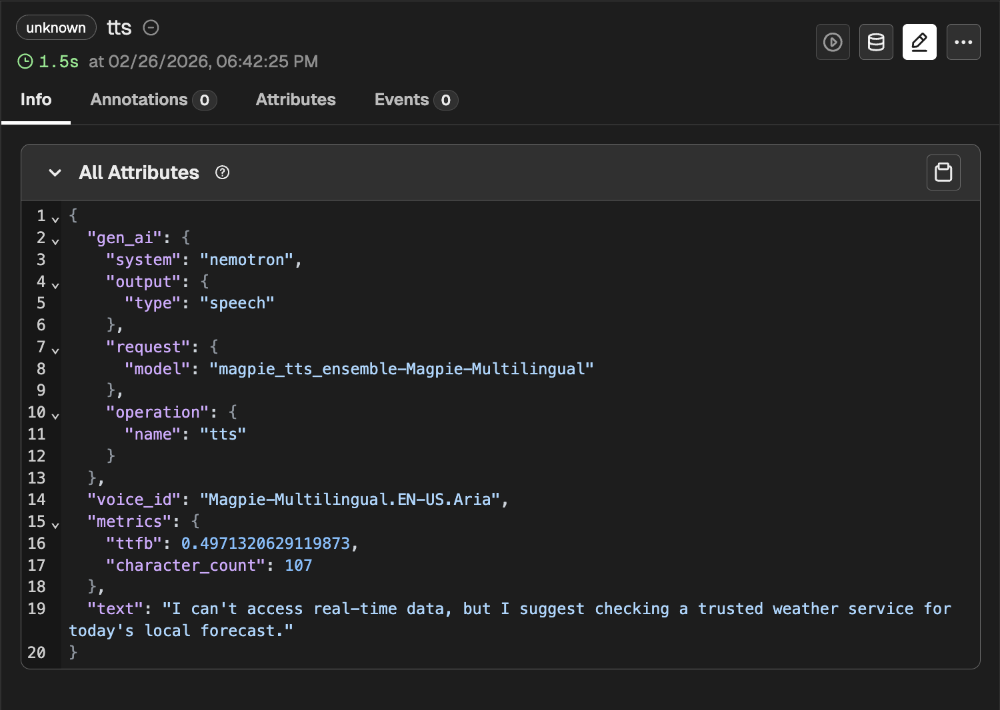

# Enable OpenTelemetry Tracing

OpenTelemetry tracing provides comprehensive observability for your voice agent pipeline, allowing you to monitor performance, debug issues, and analyze conversation flows. The following steps show how to enable tracing with [Phoenix](https://arize.com/docs/phoenix/self-hosting).

## Steps

1. Add the Phoenix service to the `docker-compose.yml` file as follows.

    ```yaml
    phoenix:
      image: arizephoenix/phoenix:latest
      ports:
        - "6006:6006"  # UI and OTLP HTTP collector
        - "4317:4317"  # OTLP gRPC collector
      restart: unless-stopped
    ```

2. Edit the `.env` file and enable tracing as follows.

    ```bash
    # In .env file
    ENABLE_TRACING=true
    OTEL_CONSOLE_EXPORT=false  # Set to true for console output (useful for debugging)
    OTEL_EXPORTER_OTLP_ENDPOINT=phoenix:4317  # Phoenix OTLP endpoint (gRPC on port 4317)
    ```

    **Configuration Options**
    - `ENABLE_TRACING`: Set to `true` to enable OpenTelemetry tracing.
    - `OTEL_CONSOLE_EXPORT`: Set to `true` to also export traces to console (useful for local debugging).
    - `OTEL_EXPORTER_OTLP_ENDPOINT`: The OTLP endpoint URL for trace export.
      - For **gRPC** (port 4317): Use `host:port` format (for example, `phoenix:4317` or `localhost:4317`).
      - For **HTTP** (port 4318 or custom): Use `http://host:port` format (for example, `http://phoenix:4318`).

3. Deploy the services.

    ```bash
    docker compose up -d
    ```

4. Open the Phoenix UI dashboard on your browser.

    ```text
    http://localhost:6006
    ```

    For remote access, use the following URL, replacing `your-server-ip` with your server's public IP address.

    ```text
    http://your-server-ip:6006
    ```

Through the Phoenix UI dashboard, you can:
- View distributed traces from your voice agent pipeline.
- Analyze conversation flows and latency.
- Monitor ASR, LLM, and TTS performance.
- Debug issues with detailed span information.

**Note:** The current implementation in `src/pipeline.py` supports OTLP exporters (HTTP and gRPC). For alternative tracing backends, refer to the [OpenTelemetry Tracing with Pipecat](https://github.com/pipecat-ai/pipecat-examples/tree/main/open-telemetry) documentation.

## Phoenix UI Walkthrough

If you are not familiar with OpenTelemetry, Phoenix can look unfamiliar. This section walks you through the UI and explains what each part of a voice-agent trace means.

### 1. Open Phoenix and Open Your Project

Open **http://localhost:6006** (or `http://your-server-ip:6006`). The **Projects** page opens. Click the `default` project to open it.



### 2. View Spans and Traces

Inside the project, you can find the following tabs: **Spans**, **Traces**, **Sessions**, **Metrics**, **Config**.

- Open the **Spans** tab to see individual operations (each row is one "span"). Leave the trace filter as **All** (or **Root Spans** if you only want top-level turns).



The voice agent produces four span **kinds**:

| Kind  | What it represents in the pipeline |
|-------|------------------------------------|
| **turn** | One full user–agent exchange: from user speech through ASR → LLM → TTS → playback. |
| **stt**  | Speech-to-Text (ASR): converting the user's audio to text. |
| **llm**  | Large Language Model: processing the transcript and generating the text reply (includes TTFB and completion). |
| **tts**  | Text-to-Speech: turning the LLM's text into audio. |

### 3. Trace Details and Span Attributes

Click a **trace** (e.g. from the Traces tab or from a span) to open **Trace Details**. The left panel shows the tree of spans; the right panel shows **Attributes** for the selected span.



You can click on any individual span to view detailed attributes and timings.

Below are sample spans for ASR, LLM, and TTS:

**STT span** (Speech-to-Text):



**LLM span**:



**TTS span**:


